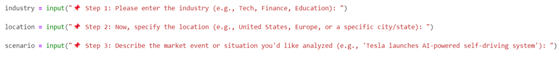
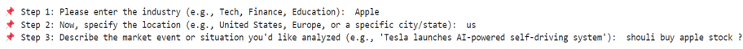
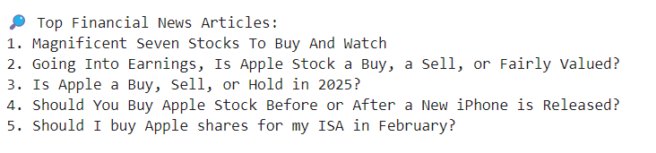
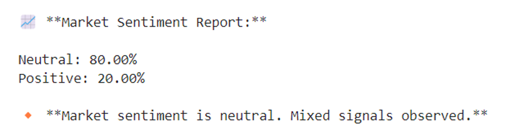

# AI-Powered Market Sentiment Analysis Agent (AI, Python, LangChain, SERP API)

## Overview

This project builds an end-to-end market sentiment analysis agent that collects user context—industry, location, and market scenario—retrieves relevant financial news or market information, and produces a structured sentiment report. The objective is to support decision‑making for business, investment, or risk‑management scenarios with AI‑generated signals derived from current events.

The repository contains a notebook prototype for development and a Streamlit application for an interactive demonstration. The architecture is designed to accommodate LangChain tools and SERP API for live web search and large‑language‑model processing.

## Project Structure

```
ai-market-sentiment-analysis-agent/
├─ app/
│  └─ streamlit_app.py           # Streamlit web app (placeholder logic)
├─ notebooks/
│  └─ Market_Sentiment_Analysis_Formatted.ipynb
├─ docs/
│  └─ GBA478_Assignment_2.pdf    # Assignment description / background
├─ presentation/
│  └─ M_2_Assignmeent_Awais.pptx # Presentation slides
├─ images/
│  ├─ inputs.png                 # Step‑by‑step user input prompts
│  ├─ user_responses.png         # Captured user responses in the app
│  ├─ agent_research.png         # Articles and sources retrieved by the agent
│  └─ analysis_report.png        # Example market sentiment report
├─ .gitignore
├─ requirements.txt              # Minimal dependencies
└─ README.md
```

## Data Collection Flow

The sentiment agent operates as follows:

1. **Industry input:** The user specifies an industry (e.g., "Tech", "Finance", "Education").
2. **Location input:** The user identifies the location or market (e.g., "US", "Europe", "APAC").
3. **Scenario input:** The user describes a market event or question (e.g., “Should I buy Apple stock?”, “Regulation on AI in the EU”, or “Oil supply disruption”).
4. **Information retrieval:** The agent is designed to fetch relevant articles and market data via SERP API.
5. **Summarization:** A language model produces a sentiment summary and highlights key points, yielding a report for decision‑making.

The current Streamlit app includes placeholders for information retrieval and summarization. Integrate LangChain with SERP API and your chosen large‑language‑model provider to enable live analysis.

## Screenshots

### User Input Stage

This image shows the initial prompt sequence for industry, location, and event description.



### Captured User Responses

After the user fills out the fields, the application stores these responses before starting the analysis.



### Agent Research

The agent will search financial news and market data. In this prototype, the research phase is represented by a placeholder.



### Market Sentiment Report

A structured sentiment report summarises the prevailing sentiment and the agent’s interpretation of market signals.



## Running the Streamlit Application

To install the minimal requirements and run the demonstration app:

```bash
# Create and activate a virtual environment (optional but recommended)
python3 -m venv venv
source venv/bin/activate

# Install dependencies
pip install -r requirements.txt

# Set API keys (optional; store keys in a .env file in the project root)
# OPENAI_API_KEY=... 
# SERPAPI_API_KEY=...

# Launch the Streamlit app
streamlit run app/streamlit_app.py
```

If no API keys are set, the app will run in demo mode and display placeholder reports. For live analysis, supply valid keys and implement calls to LangChain, SERP API, and your language model of choice.

## Technologies Used

- **Python** — Primary programming language
- **Streamlit** — For the interactive application UI
- **LangChain** — To orchestrate tools and models (integration placeholder)
- **SERP API** — For external news and data search (integration placeholder)
- **dotenv** — For secure local management of API keys

## Next Steps

- Integrate SERP API for real‑time news retrieval.
- Use LangChain to call your large‑language‑model (e.g., via OpenAI or other providers) to summarise research.
- Assign sentiment scores to individual articles and aggregate them in the final report.
- Deploy the Streamlit app publicly via Streamlit Cloud or another hosting platform.
- Extend the prototype with additional risk metrics or trending indicators.

## Notes

- Do **not** commit any `.env` file or secret API keys to version control. The `.gitignore` file in this repository ensures that `.env` and other sensitive files are excluded by default.
- The repository includes an assignment brief (PDF) and presentation slides for context. These are not needed to run the app but provide background on the project scope.

